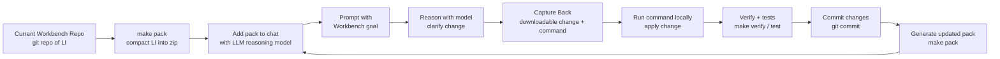

# Workbench Build Loop



## Plain-language version

A Workbench is a git repository of Language Infrastructure.

The Workbench is shared with an LLM reasoning model through a pack zip. The human adds the latest pack to chat and explains the current goal. The model helps reason toward a change. When the change is ready, the human captures the useful reasoning, decisions, context, and continuity back into the repo through a downloadable change and local command.

The human runs the command locally, verifies the repo, commits the change, and creates a fresh pack.

The updated pack starts the next cycle.

```text
pack → chat reasoning → capture back → local apply → verify → commit → new pack → repeat
```

## Current-state anti-drift rule

```text
No Capture Back without current state.
```

Steps 3, 4, and 5 must force current-state grounding:

- Capture Back must inspect the current target Workbench state before patching.
- Verify must prove the change fits the current state and does not drift.
- Commit + Repack must make the verified state the next reasoning baseline.

Short form:

```text
Reason from the current Workbench.
Capture Back into the current Workbench.
Verify before the Workbench remembers.
```
