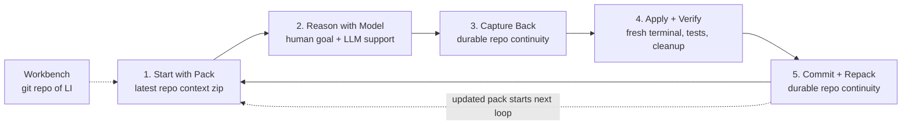

# Simple Workbench Loop



## One-sentence explanation

A Workbench grows when a human uses an LLM to reason from the latest pack, captures useful reasoning and decisions back into the repo, applies and verifies the change locally, commits it, and creates the next pack.

## Short form

```text
Pack → Reason → Capture Back → Verify → Commit + Repack → Repeat
```

## Current-state anti-drift rule

```text
No Capture Back without current state.
```

Steps 3, 4, and 5 must force current-state grounding:

- Capture Back must inspect the current target Workbench state before patching.
- Verify must prove the change fits the current state and does not drift.
- Commit + Repack must make the verified state the next reasoning baseline.

Short form:

```text
Reason from the current Workbench.
Capture Back into the current Workbench.
Verify before the Workbench remembers.
```
